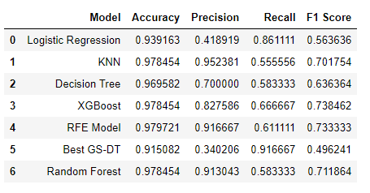

# NBA Hall of Fame Prediction Model
 
Authors: Chaz Frazer & Ryan Lewis<br>

# Overview
This project applies machine learning classification modeling to predict whether or not eligible NBA players will be voted into the Naismith Memorial Basketball Hall of Fame. For our purposed, we will be more focused on predictive vs inference models. Precision will be a key metric for our final model, as we want to maximize the our positive predictive value, meaning that when our model predicts that an NBA player is an HOFer, they actually are one.<br><br>

# Business Problem
Out of the 4,374 eligible NBA Players on 177 of them have been voted into the Hall of Fame. Based on this, can you accurately predict if eligible NBA players will be elected into the Naismith Memorial Basketball Hall of Fame based on career statistics and accolades?<br><br>

# Data
The data used in this project was originally pulled from Kaggle (via basketball-reference.com), it consisted of NBA player seasonal statistics from 1950 to 2017. This data set included box score statistics such as Points & Rebonds, to games played and some more advanced statistics such as Win Share. We aggregated these statistics down to create career statistics for each player. 
Additionally we sourced data related to all-star selections, MVP awards and NBA finals appearances. We then merged this into our aggregated data set and then finally subset our data for only those players eligible to be voted into the Hall of Fame. (Retired before 2014 -- players must be retied for 3 years in order to be eligible.)<br><br>

# Exploratory Data Analysis
Once our data was properly cleaned and formatted, we began to explore our data and investigate which of our features correlate most with our target variable of 'HOF'. It became evident that all-star appearences had major correlation and should be considered for our models. <br>
<br>

Further analyzing our data we can start to see the relationship both Win Share and Points have with identifying HOFers. In the scatterplot graph below you can see has both metrics increase, more HOF players appear on the plot. <br>
 <br><br>

# Feature Engineering
During EDA we created several custom features in order to better identify NBA HOFers, below are the ones used in our final model:
* 'Title_Star' -- NBA players who have won a championship and have an all-star appearance
* '20/10_B' -- NBA players who average over 20 points and 10 rebounds in thier career
* 'Leader_Pts' -- NBA players who have scored more than 20,000 points in thier career<br><br>

# Modeling & Results
After our EDA and feature engineering we were ready to begin our modeling the process. Below is a summary of results from multiple different classification models.<br>

<br><br>

## Final Model - KNN
Most of our models above show great accuracy, but due to class imbalance in our data set we cannot solely rely on accuracy to grade our model. As mentioned earlier, we're focused on having a high precision score in order to reduce our model's false positives predictions. This lead to choose our KNN model as our final model as it has the highest precision score at 95.2% and our second strongest F1 score, showing this model performs well overall.<br>
 <br><br>

# Next Steps
* Update data set to include data from 2018-2020 seasons
* Incorporate additional advanced analytics statistics, foreign born status
* Use our final KNN model to predict on the current & not yet eligible NBA players <br><br>

# References

* Kaggle Data Set -- https://www.kaggle.com/drgilermo/nba-players-stats <br>
* Additional Award Data -- https://www.basketball-reference.com/ <br><br>

# Repository Structure
```
├── data
├── img
├── trials
│   └── nba_hof_workbook.ipynb
├── final_nba_hof.ipynb
├── README.md
└── NBA_HOF_Predictions.pdf